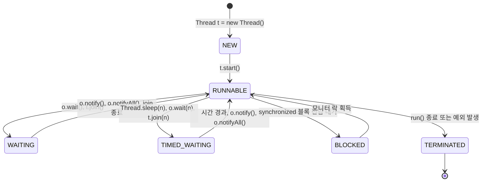

# 2. Thread 기초

이 장에서는 자바에서 스레드를 생성하고 실행하는 기본적인 방법과 스레드의 상태 변화에 대해 배웁니다.

## 학습 내용

### 2.1 Thread 클래스와 Runnable 인터페이스 (비유: 요리사와 레시피)

자바에서 스레드를 구현하는 방법은 크게 두 가지가 있습니다. 비전공자라면 **'요리사(Thread)'**와 **'레시피(Runnable)'**의 관계로 이해하면 쉽습니다.

*   **Runnable (레시피)**: 무엇을 할지 적혀 있는 종이입니다. 그 자체로는 움직이지 않습니다.
*   **Thread (요리사)**: 레시피를 보고 실제로 요리를 하는 주체입니다.

1.  **Thread 클래스 상속 (요리사가 직접 레시피를 몸에 문신함)**: `Thread` 클래스를 상속받아 `run()` 메소드를 오버라이드합니다.
    *   장점: 간단함.
    *   단점: 요리사가 이미 레시피를 몸에 새겨버려서 다른 요리(클래스 상속)를 할 수 없음. 자바는 단일 상속만 지원하기 때문입니다.
2.  **Runnable 인터페이스 구현 (요리사가 레시피 북을 읽음)**: `Runnable` 인터페이스의 `run()` 메소드를 구현하고, 이를 `Thread` 객체에 전달합니다.
    *   장점: 다중 상속 제약에서 자유롭고, 요리사(Thread)와 레시피(Runnable)가 분리되어 있어 레시피만 갈아 끼우면 다른 요리사도 같은 일을 할 수 있음. (권장되는 방식)

### 2.2 스레드 생성과 실행

스레드를 만들었다고 바로 실행되는 것이 아닙니다. `start()` 메소드를 호출해야 운영체제가 스레드를 관리하기 시작합니다.

[ThreadCreation.java](../../src/main/java/com/nhnacademy/fundamentals/ThreadCreation.java)

```java
package com.nhnacademy.fundamentals;

import lombok.extern.slf4j.Slf4j;

/**
 * 스레드를 생성하는 세 가지 방법을 보여주는 예제입니다.
 * 쉽게 이해하기:
 * - Thread 상속: 요리사가 직접 레시피를 몸에 문신함 (클래스 자체가 스레드가 됨)
 * - Runnable 구현: 요리사가 레시피 북을 따로 들고 있음 (할 일과 작업자를 분리함)
 */
@Slf4j
public class ThreadCreation {
    public static void main(String[] args) {
        // 1. Thread 클래스 상속 방식
        // MyThread 클래스는 Thread를 상속받았으므로 그 자체로 스레드 객체입니다.
        Thread myThread = new MyThread();
        myThread.start(); // 새로운 실타래 시작!

        // 2. Runnable 인터페이스 구현 방식 (익명 클래스)
        // Thread라는 '작업자'에게 Runnable이라는 '할 일'을 전달합니다.
        Thread runnableThread = new Thread(new Runnable() {
            @Override
            public void run() {
                log.info("방법 2 (익명 클래스): {} 스레드가 일을 합니다.", Thread.currentThread().getName());
            }
        });
        runnableThread.start();

        // 3. Runnable 구현 방식 (람다식 - 현대적이고 가장 권장되는 방식)
        // 코드가 간결하며 '할 일'만 명확하게 보여줍니다.
        Thread lambdaThread = new Thread(() -> {
            log.info("방법 3 (람다식): {} 스레드가 간결하게 일을 합니다.", Thread.currentThread().getName());
        });
        lambdaThread.start();
    }
}

/**
 * Thread 클래스를 상속받아 직접 스레드를 정의합니다.
 */
@Slf4j
class MyThread extends Thread {
    @Override
    public void run() {
        log.info("방법 1 (클래스 상속): {} 스레드가 상속받은 일을 합니다.", Thread.currentThread().getName());
    }
}
```

#### [실습] Runnable 구현을 통한 스레드 생성

앞서 배운 내용을 바탕으로 `Runnable` 인터페이스를 구현하는 클래스를 작성하고 실행해 봅시다.

[ThreadCreationExercise.java](../../src/main/java/com/nhnacademy/fundamentals/ThreadCreationExercise.java)

*   **주의**: `run()`을 직접 호출하면 안 됩니다. `run()`은 그냥 메소드를 호출하는 것이고, `start()`가 새로운 스택을 생성하여 별도의 흐름으로 실행하게 합니다.

### 2.3 스레드 생명주기 (Thread Lifecycle)

스레드는 태어나서 죽을 때까지 여러 상태를 거칩니다.

[ThreadLifecycle.java](../../src/main/java/com/nhnacademy/fundamentals/ThreadLifecycle.java)

```java
package com.nhnacademy.fundamentals;

import lombok.extern.slf4j.Slf4j;

/**
 * 자바 스레드의 생명주기(상태 변화)를 관찰하는 예제입니다.
 * 쉽게 이해하기:
 * - NEW: 아이가 태어났지만 아직 걷지 못함 (객체 생성)
 * - RUNNABLE: 아이가 걷기 시작함 (실행 중 또는 실행 가능)
 * - TIMED_WAITING: 아이가 낮잠을 자는 중 (일정 시간 대기)
 * - TERMINATED: 아이가 일과를 마치고 잠자리에 듬 (종료)
 */
@Slf4j
public class ThreadLifecycle {
    public static void main(String[] args) throws InterruptedException {
        // 1. 새로운 스레드 객체 생성 (아직 시작 안 함)
        Thread thread = new Thread(() -> {
            try {
                // 1초간 잠들기 (TIMED_WAITING 상태가 됨)
                Thread.sleep(1000); 
                synchronized (ThreadLifecycle.class) {
                    // 락을 기다릴 때 BLOCKED 상태가 될 수 있음
                }
            } catch (InterruptedException e) {
                log.error("스레드 오류 발생", e);
                Thread.currentThread().interrupt();
            }
        });

        // NEW 상태 출력
        log.info("상태 1 (생성 직후): {}", thread.getState()); 

        // 2. 스레드 시작
        thread.start();
        // RUNNABLE 상태 출력 (실행 중일 때)
        log.info("상태 2 (시작 직후): {}", thread.getState()); 

        // 스레드가 sleep()에 들어갈 때까지 잠시 대기
        Thread.sleep(500);
        // TIMED_WAITING 상태 출력
        log.info("상태 3 (잠자는 중): {}", thread.getState()); 

        // 스레드가 끝날 때까지 기다림
        thread.join();
        // TERMINATED 상태 출력
        log.info("상태 4 (종료 후): {}", thread.getState()); 
    }
}
```

1.  **NEW**: 스레드 객체가 생성되었지만 아직 `start()`가 호출되지 않은 상태.
2.  **RUNNABLE**: 실행 중이거나 실행 가능한 상태 (운영체제의 스케줄러를 기다림).
3.  **WAITING / TIMED_WAITING**: 다른 스레드의 통지(notify)나 일정 시간을 기다리는 상태.
4.  **BLOCKED**: 임계 영역(synchronized)에 들어가기 위해 락을 기다리는 상태.
5.  **TERMINATED**: 실행이 종료된 상태.

#### [실습] 스레드 생명주기 관찰하기

앞서 배운 내용을 바탕으로 스레드의 각 상태(NEW, RUNNABLE, TIMED_WAITING, TERMINATED)가 어떻게 변하는지 확인해 봅시다.

[ThreadLifecycleExercise.java](../../src/main/java/com/nhnacademy/fundamentals/ThreadLifecycleExercise.java)

### 2.4 스레드 우선순위와 Daemon 스레드

*   **스레드 이름**: `setName()`으로 이름을 지정하면 디버깅 시 어떤 스레드가 작업 중인지 쉽게 파악할 수 있습니다.
*   **우선순위 (Priority)**: 1(MIN)부터 10(MAX)까지 부여할 수 있지만, 운영체제마다 동작 방식이 달라 절대적인 실행 순서를 보장하지는 않습니다.
*   **데몬 스레드 (Daemon Thread)**: 주 스레드(Main Thread)의 작업을 돕는 보조적인 역할을 수행합니다.

[ThreadProperties.java](../../src/main/java/com/nhnacademy/fundamentals/ThreadProperties.java)

```java
package com.nhnacademy.fundamentals;

import lombok.extern.slf4j.Slf4j;

/**
 * 스레드의 속성(이름, 우선순위)을 설정하고 확인하는 예제입니다.
 * 쉽게 이해하기:
 * - 이름: 작업자에게 이름표를 달아주는 것과 같습니다. (디버깅 시 매우 중요!)
 * - 우선순위: 작업자들 중 누가 더 급한 일을 하는지 OS에게 힌트를 줍니다.
 */
@Slf4j
public class ThreadProperties {
    public static void main(String[] args) {
        // 스레드가 할 일 정의
        Thread thread = new Thread(() -> {
            log.info("작업자 이름: {}", Thread.currentThread().getName());
            log.info("작업자 우선순위: {}", Thread.currentThread().getPriority());
        });

        // 1. 스레드 이름 설정 (달지 않으면 Thread-0 같은 기본 이름이 붙음)
        thread.setName("Custom-Worker-01");

        // 2. 우선순위 설정 (1 ~ 10, 기본값은 5)
        // 주의: OS마다 동작이 다를 수 있어 절대적인 순서를 보장하지는 않습니다.
        thread.setPriority(Thread.MAX_PRIORITY); // 가장 높은 우선순위(10)

        // 3. 실행
        thread.start();
    }
}
```

#### [예제] 스레드 종료와 Interruption

스레드를 중간에 멈추게 하려면 `stop()`(Deprecated) 대신 `interrupt()`를 사용해야 합니다.

[ThreadInterruption.java](../../src/main/java/com/nhnacademy/fundamentals/ThreadInterruption.java)

```java
package com.nhnacademy.fundamentals;

import lombok.extern.slf4j.Slf4j;

/**
 * 스레드를 안전하게 중단시키는 방법을 보여주는 예제입니다.
 * 쉽게 이해하기:
 * - interrupt(): 작업자에게 "이제 그만하고 퇴근해!"라고 신호를 보내는 것과 같습니다.
 * - 작업자는 이 신호를 받고 하던 일을 안전하게 정리하고 종료해야 합니다.
 */
@Slf4j
public class ThreadInterruption {
    public static void main(String[] args) throws InterruptedException {
        // 1. 작업자 스레드 생성
        Thread worker = new Thread(() -> {
            // isInterrupted(): 누군가 나에게 퇴근 신호를 보냈는지 확인합니다.
            while (!Thread.currentThread().isInterrupted()) {
                log.info("작업자: 열심히 일하는 중...");
                try {
                    // 0.1초 동안 대기
                    Thread.sleep(100);
                } catch (InterruptedException e) {
                    // sleep 중에 퇴근 신호(interrupt)를 받으면 예외가 발생합니다.
                    log.error("작업자: 자는 동안 퇴근 신호를 받았어요! 하던 일을 정리합니다.");
                    // 중요: InterruptedException이 발생하면 인터럽트 상태가 초기화되므로 
                    // 다시 설정해주거나 루프를 빠져나가야 합니다.
                    Thread.currentThread().interrupt(); 
                }
            }
            log.info("작업자: 안전하게 도구를 정리하고 퇴근합니다.");
        });

        worker.start();
        
        // 메인 스레드가 0.5초 동안 지켜봅니다.
        Thread.sleep(500);
        
        log.info("메인: 이제 작업자에게 퇴근 신호를 보냅니다.");
        // worker 스레드에게 중단 신호를 보냅니다.
        worker.interrupt(); 
    }
}
```

#### [실습] 스레드 안전하게 중단하기

앞서 배운 내용을 바탕으로 `interrupt()` 신호를 처리하여 스레드를 안전하게 종료하는 코드를 직접 작성해 봅시다.

[ThreadInterruptionExercise.java](../../src/main/java/com/nhnacademy/fundamentals/ThreadInterruptionExercise.java)

### 2.5 스레드 상태 전이 다이어그램 (Mermaid)


